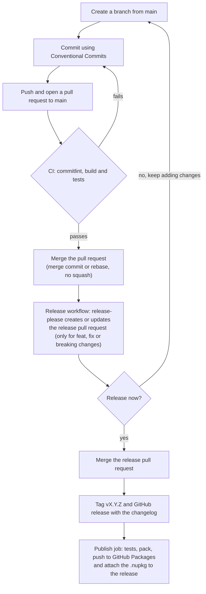

# simple-mediator

A simple mediator pattern library for .NET:

- Requests with a response (`IRequest<TResponse>`) and without a response (`IRequest`).
- Pipeline behaviors (`IPipelineBehavior<TRequest, TResponse>`) for cross-cutting concerns such as logging, validation or timeouts.
- Registration in `Microsoft.Extensions.DependencyInjection` with assembly scanning.

Target framework: `net10.0`.

## Installation

The package is published to GitHub Packages. GitHub Packages requires authentication even to read packages, so you need a
[personal access token (classic)](https://docs.github.com/en/packages/working-with-a-github-packages-registry/working-with-the-nuget-registry#authenticating-to-github-packages)
with the `read:packages` scope.

Add the feed once:

```shell
dotnet nuget add source "https://nuget.pkg.github.com/ncobianm/index.json" --name github-ncobianm --username <GITHUB_USER> --password <TOKEN>
```

On Linux and macOS, also add `--store-password-in-clear-text`, because encrypted passwords are only supported on Windows.

Then add the package:

```shell
dotnet add package SimpleMediator
```

## Getting started

All public types live in the `SimpleMediator` namespace.

### 1. Define a request and its handler

```csharp
using SimpleMediator;

public record GetGreeting(string Name) : IRequest<string>;

public class GetGreetingHandler : IRequestHandler<GetGreeting, string>
{
    public Task<string> HandleAsync(GetGreeting request, CancellationToken cancellationToken = default)
    {
        return Task.FromResult($"Hello, {request.Name}!");
    }
}
```

### 2. Register the mediator

```csharp
services.AddSimpleMediator(cfg => cfg.RegisterServicesFromAssemblyContaining<Program>());
```

This registers `IMediator` and every handler found in the given assemblies.

### 3. Send the request

```csharp
public class GreetingService(IMediator mediator)
{
    public Task<string> GreetAsync(string name, CancellationToken cancellationToken) =>
        mediator.SendAsync(new GetGreeting(name), cancellationToken);
}
```

## Requests without a response

Implement `IRequest` and `IRequestHandler<TRequest>`. `SendAsync` returns a `Task` without a value.

```csharp
public record DeleteUser(Guid UserId) : IRequest;

public class DeleteUserHandler : IRequestHandler<DeleteUser>
{
    public Task HandleAsync(DeleteUser request, CancellationToken cancellationToken = default)
    {
        // ...
        return Task.CompletedTask;
    }
}

await mediator.SendAsync(new DeleteUser(userId));
```

Internally, these requests are handled as requests returning `Unit`, so pipeline behaviors also apply to them with `TResponse = Unit`.
A behavior that short-circuits one of these requests must return `Unit.Value`.

## Pipeline behaviors

A behavior wraps the handler and decides whether to call the next step of the pipeline (`next`).

```csharp
public class LoggingBehavior<TRequest, TResponse> : IPipelineBehavior<TRequest, TResponse>
    where TRequest : IRequest<TResponse>
{
    public async Task<TResponse> HandleAsync(TRequest request, RequestHandlerDelegate<TResponse> next, CancellationToken cancellationToken = default)
    {
        Console.WriteLine($"Handling {typeof(TRequest).Name}");
        var response = await next();
        Console.WriteLine($"Handled {typeof(TRequest).Name}");
        return response;
    }
}
```

Register open generic behaviors with `AddOpenBehavior`. They run in the order they are added: the first one is the outermost.

```csharp
services.AddSimpleMediator(cfg => cfg
    .RegisterServicesFromAssemblyContaining<Program>()
    .AddOpenBehavior(typeof(LoggingBehavior<,>))
    .AddOpenBehavior(typeof(ValidationBehavior<,>)));
```

- **Short-circuit:** a behavior can return a response or throw without calling `next`. The handler is then not resolved from the container.
- **Missing handlers:** the error for a request without a registered handler (`InvalidOperationException`) is thrown inside the pipeline, so behaviors can observe it.

### Cancellation token

`next` accepts an optional `CancellationToken`:

- `next(token)` passes `token` to the rest of the pipeline and to the handler.
- `next()` keeps the token received by the current behavior.

For example, a timeout behavior:

```csharp
public class TimeoutBehavior<TRequest, TResponse> : IPipelineBehavior<TRequest, TResponse>
    where TRequest : IRequest<TResponse>
{
    public async Task<TResponse> HandleAsync(TRequest request, RequestHandlerDelegate<TResponse> next, CancellationToken cancellationToken = default)
    {
        using var timeoutCts = CancellationTokenSource.CreateLinkedTokenSource(cancellationToken);
        timeoutCts.CancelAfter(TimeSpan.FromSeconds(1));

        return await next(timeoutCts.Token);
    }
}
```

## Configuration

| Option | Description |
|---|---|
| `RegisterServicesFromAssembly(assembly)` | Scans the assembly for handlers. Adding the same assembly twice has no effect. |
| `RegisterServicesFromAssemblyContaining<T>()` | Same as above, using the assembly that contains `T`. |
| `AddOpenBehavior(typeof(MyBehavior<,>))` | Adds an open generic behavior applied to every request. Throws `ArgumentException` if the type is not an open generic type implementing `IPipelineBehavior<,>`. |
| `Lifetime` | Lifetime of the mediator, the handlers and the behaviors. Defaults to `ServiceLifetime.Transient`. |

At least one assembly is required; otherwise `AddSimpleMediator` throws `InvalidOperationException`.

### Manual registration

The mediator resolves handlers as `IRequestHandler<TRequest, TResponse>`. If you register handlers without scanning, use that service type,
including for requests without a response:

```csharp
services.AddTransient<IMediator, Mediator>();
services.AddTransient<IRequestHandler<GetGreeting, string>, GetGreetingHandler>();
services.AddTransient<IRequestHandler<DeleteUser, Unit>, DeleteUserHandler>();
```

Behaviors for a single request type are registered manually too:

```csharp
services.AddTransient<IPipelineBehavior<GetGreeting, string>, GreetingBehavior>();
```

## Known limitations

- **Open generic handlers:** handlers such as `Handler<T> : IRequestHandler<Request<T>, T>` are not discovered by assembly scanning.
- **Contravariance:** `IRequestHandler<in TRequest, TResponse>` is contravariant, but `Microsoft.Extensions.DependencyInjection` does not use variance to resolve services. A handler for a base request type only applies if you register it manually for the concrete request type.
- **Duplicate registrations:** calling `AddSimpleMediator` more than once with the same assembly registers its handlers twice. The last registration wins.

## Sample and tests

- `src/SimpleMediator.Sample` is a console application that shows the features above: requests with and without a response, and logging, timeout and validation behaviors. Run it with `dotnet run --project src/SimpleMediator.Sample`.
- `tests/SimpleMediator.Tests` contains the unit tests (xUnit and NSubstitute). Run them with `dotnet test`.

## Contributing

- **Commits:** every commit must follow [Conventional Commits](https://www.conventionalcommits.org/) (`feat: ...`, `fix: ...`, `docs: ...`). The `commitlint` check validates them on pull requests and pushes to `main`.
- **Pull requests:** PR titles are free text and are not used for versioning. Merge with a merge commit or rebase, not squash: a squash commit takes the PR title as its message, so its changes would not be versioned.

## Development workflow



1. **Develop:** create a branch from `main` and commit using Conventional Commits. The commit types decide the next version.
2. **Pull request:** open a pull request to `main`. The CI workflow validates the commit messages, builds and runs the tests.
3. **Merge:** merge the pull request with a merge commit or rebase, not squash.
4. **Release pull request:** on every push to `main`, release-please creates or updates a release pull request. It accumulates the changes of all the merged pull requests: the next version, the `CHANGELOG.md` entry and the `<Version>` of the project.
5. **Release:** when you want to release, merge the release pull request. This creates the `vX.Y.Z` tag and the GitHub release.
6. **Publish:** the release workflow runs the tests again, packs the library, publishes it to GitHub Packages and attaches the `.nupkg` to the release.

## Releasing

Versions follow SemVer (`X.Y.Z`) and are calculated from the commits by [release-please](https://github.com/googleapis/release-please):

| Commit | Version bump |
|---|---|
| `fix:` | Patch (`1.0.0` → `1.0.1`) |
| `feat:` | Minor (`1.0.0` → `1.1.0`) |
| `feat!:`, `fix!:` or a `BREAKING CHANGE:` footer | Major (`1.0.0` → `2.0.0`) |

Other types (`docs:`, `refactor:`, `test:`, `chore:`...) don't trigger a release.

1. Each push to `main` creates or updates a release pull request with the next version, the `CHANGELOG.md` entry and the `<Version>` in `src/SimpleMediator/SimpleMediator.csproj`.
2. Merging that pull request creates the `vX.Y.Z` tag and the GitHub release.
3. The release workflow then runs the tests, packs the library, publishes it to GitHub Packages and attaches the `.nupkg` to the release.

The workflows are in `.github/workflows`: `ci.yml` (commitlint, build and tests) and `release.yml` (release PR, release and publishing).
