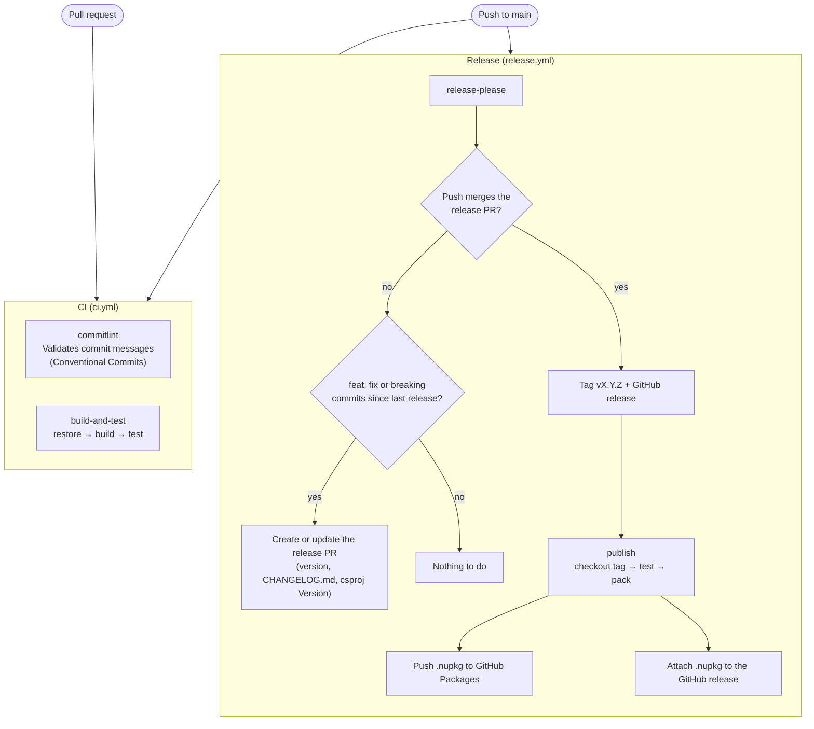

# Pipelines

The repository has two GitHub Actions workflows in `.github/workflows`:

| Workflow | File | Triggers | Jobs |
|---|---|---|---|
| CI | `ci.yml` | Pull requests, pushes to `main` | `commitlint`, `build-and-test` |
| Release | `release.yml` | Pushes to `main` | `release-please`, `publish` |

## Flow

Merging the release pull request is itself a push to `main`: it runs both workflows again, and this time `release-please` creates the release and `publish` runs.

## CI (`ci.yml`)

Runs on every pull request and on every push to `main`. Both jobs run in parallel.

| Job | Steps |
|---|---|
| `commitlint` | Checks out the full history and validates the messages of the commits in the pull request or push with `@commitlint/config-conventional`. Merge commits are ignored. Pull request titles are not validated. |
| `build-and-test` | Sets up .NET 10, then runs `dotnet restore`, `dotnet build -c Release` and `dotnet test -c Release` on `SimpleMediator.slnx`. |

## Release (`release.yml`)

Runs on every push to `main`. Only one run at a time (`concurrency: release`).

| Job | Runs when | Steps |
|---|---|---|
| `release-please` | Always | If the push merges the release pull request, it creates the `vX.Y.Z` tag and the GitHub release. Otherwise, it creates or updates the release pull request when there are `feat`, `fix` or breaking change commits since the last release. |
| `publish` | A release was created | Checks out the tag, runs the tests, packs `src/SimpleMediator`, pushes the package to `https://nuget.pkg.github.com/ncobianm/index.json` and attaches the `.nupkg` to the release. |

### Permissions

| Job | Permissions |
|---|---|
| `release-please` | `contents: write`, `issues: write`, `pull-requests: write` |
| `publish` | `contents: write`, `packages: write` |

Both jobs use the built-in `GITHUB_TOKEN`. The repository setting *Allow GitHub Actions to create and approve pull requests* must be enabled so that release-please can open the release pull request.

## Configuration files

| File | Purpose |
|---|---|
| `release-please-config.json` | release-please settings: `simple` release type, `vX.Y.Z` tags and the `.csproj` as an extra file to update. |
| `.release-please-manifest.json` | Last released version. Updated by release-please. |
| `commitlint.config.mjs` | commitlint rules (`@commitlint/config-conventional`). |
| `src/SimpleMediator/SimpleMediator.csproj` | `<Version>` is marked with `x-release-please-version` so the release pull request updates it. |
